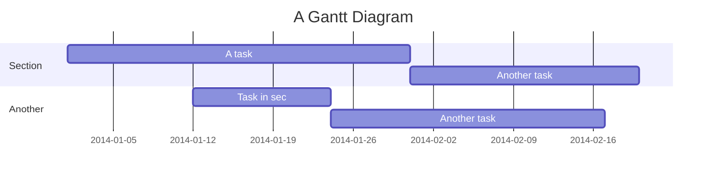

# GitHub Demo Markdown File

## Headings
### H3 Heading
#### H4 Heading
##### H5 Heading
###### H6 Heading

## Text

Some body text

## List

* bullet
* items

1. Numbered list
1. Of items

## Quote

> Quoted text

## Link

[Google](https://google.com)

## Image

## Mermaid

More information about **mermaid** syntax [here](https://mermaid-js.github.io/mermaid/).

## LaTeX

You can render *LaTeX* mathematical expressions as on [math.stackexchange.com](https://math.stackexchange.com/). Examples:

* The Euler's identity: $e^{i\pi} + 1 = 0$
* The solution of $f(x)=ax^2+bx+c$ where $a \neq 0$ and $a, b, c \in R$ is
$$
x = {-b \pm \sqrt{b^2-4ac} \over 2a}
$$
* The *Gamma function*: $\Gamma(n) = \begin{cases}
  \displaystyle (n-1)!\quad\forall n\in\mathbb N\\
  \displaystyle \int_0^\infty t^{n-1}e^{-t}dt\quad\forall n\in\mathbb R^*_+
  \end{cases}$

More information about **LaTeX** mathematical expressions [here](https://meta.math.stackexchange.com/questions/5020/mathjax-basic-tutorial-and-quick-reference).
